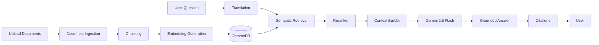
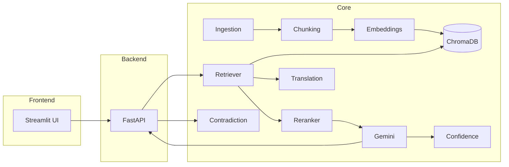
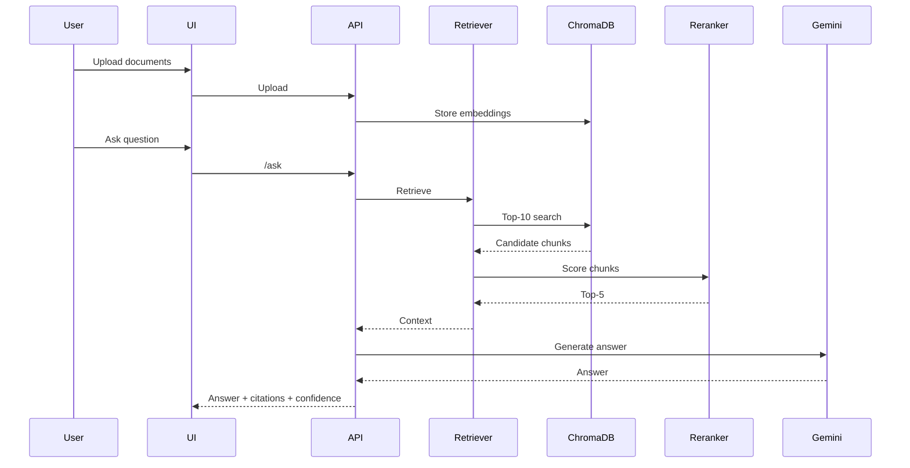
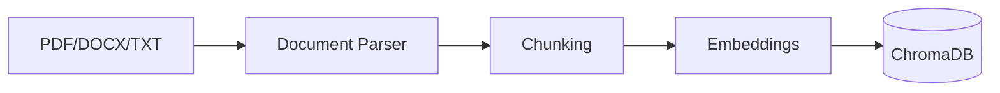
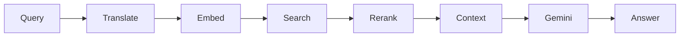
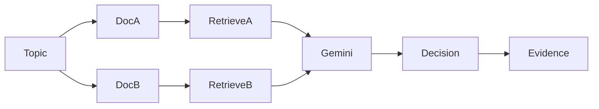
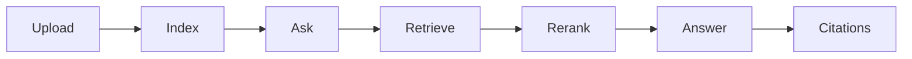
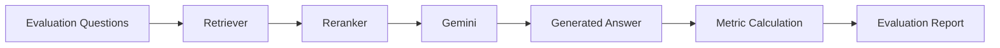
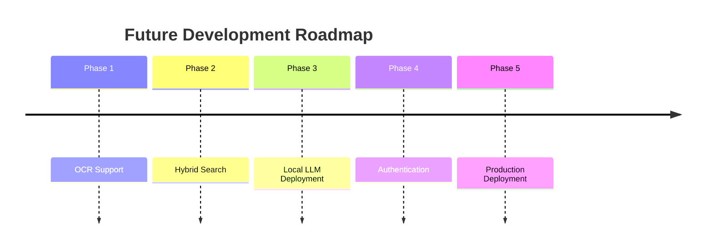

# 🤖 Document Q&A with Citations - Onkar Shahapurkar
### Intelligent Retrieval-Augmented Generation (RAG) System with Semantic Search, Multilingual Question Answering, Contradiction Detection, Confidence Scoring, and FastAPI Integration

<p align="center">


</p>

---

# 📖 Project Overview

This project is a production-inspired **Retrieval-Augmented Generation (RAG)** application developed as part of the **POTENS AI/ML Internship Assignment**.

The system enables users to upload one or more documents and interact with them using natural language. Instead of relying solely on the internal knowledge of a Large Language Model (LLM), the application retrieves the most relevant information from uploaded documents, grounds every generated response in retrieved evidence, and presents citations to improve transparency and trustworthiness.

Beyond traditional document question answering, the system incorporates several advanced capabilities commonly found in modern enterprise AI applications, including multilingual query support, contradiction detection across documents, semantic reranking, confidence estimation, and a modular REST API for integration with external systems.

---

# 🎯 Objectives

- Build a modular Retrieval-Augmented Generation (RAG) system.
- Support semantic search over uploaded documents.
- Generate grounded responses using retrieved context.
- Detect contradictions between multiple documents.
- Support multilingual queries.
- Estimate answer confidence.
- Provide explainable responses through citations.
- Expose functionality through a REST API.

---

# ✨ Key Features

## Document Processing

- Upload PDF, DOCX and TXT documents
- Intelligent chunking
- Metadata preservation
- Embedding generation
- ChromaDB indexing

## Retrieval Pipeline

- Semantic vector search
- Translation-assisted retrieval
- Cross-Encoder reranking
- Context construction

## Question Answering

- Gemini 2.5 Flash
- Citation-aware responses
- Grounded generation

## Multilingual Support

Supported languages:

- English
- Hindi
- Marathi

## Contradiction Analysis

- Cross-document comparison
- Evidence extraction
- Conflict explanation

## Confidence Estimation

- Confidence score
- Confidence level
- Human review recommendation

## REST API

Endpoints:

- `/health`
- `/ask`
- `/contradict`

---

# 🛠 Technology Stack

| Layer | Technology |
|--------|------------|
| Language | Python 3.12+ |
| Backend | FastAPI |
| Frontend | Streamlit |
| LLM | Gemini 2.5 Flash |
| Vector Database | ChromaDB |
| Reranker | cross-encoder/ms-marco-MiniLM-L6-v2 |
| Testing | PyTest |

---

# 📁 Repository Structure

```text
potens-ai-rag/
├── api/
├── src/
├── ui/
├── evaluation/
├── tests/
├── requirements.txt
├── README.md
└── .env.example
```

---

# 🏗 High-Level Architecture



---

# 🚀 Highlights

- Modular architecture
- Explainable AI with citations
- Multilingual RAG
- Semantic reranking
- Confidence-aware responses
- FastAPI + Streamlit
- Production-inspired design

---

**Next:** Section 2 covers the detailed architecture, component interactions, pipelines, and design decisions.

# Group 2 --- System Architecture & Design

# 🏗 Architecture Philosophy

The application follows a modular Retrieval-Augmented Generation (RAG)
architecture. Each subsystem has a single responsibility, making the
project maintainable, testable, and easy to extend.

Core design principles:

-   Separation of concerns
-   Dependency injection
-   Retrieval before generation
-   Explainable AI through citations
-   API-first backend
-   UI decoupled from business logic

------------------------------------------------------------------------

# Overall Component Architecture



------------------------------------------------------------------------

# End-to-End Processing Pipeline



------------------------------------------------------------------------

# Document Ingestion Pipeline



Steps:

1.  Validate uploaded file.
2.  Extract text.
3.  Preserve metadata.
4.  Split into overlapping chunks.
5.  Generate embeddings.
6.  Store vectors and metadata.

------------------------------------------------------------------------

# Retrieval Pipeline



The retriever first performs semantic vector search, then optionally
reranks the retrieved chunks before constructing the final context
passed to the LLM.

------------------------------------------------------------------------

# Contradiction Detection



The system compares evidence from both documents and produces a
structured explanation instead of a simple yes/no response.

------------------------------------------------------------------------

# Confidence Scoring

Confidence combines multiple heuristics:

-   Retrieval quality
-   Context coverage
-   Citation coverage
-   Number of retrieved chunks

This provides a transparent estimate of answer reliability.

------------------------------------------------------------------------

# Design Decisions

  -----------------------------------------------------------------------
  Decision                                Reason
  --------------------------------------- -------------------------------
  ChromaDB                                Lightweight embedded vector
                                          database

  Gemini 2.5 Flash                        Fast inference and strong
                                          reasoning

  FastAPI                                 Typed, modular REST API

  Streamlit                               Rapid interactive interface

  Cross-Encoder reranker                  Improves retrieval precision

  Translation before retrieval            Reuses English embeddings while
                                          supporting multilingual queries
  -----------------------------------------------------------------------

------------------------------------------------------------------------

# Module Responsibilities

  Module             Responsibility
  ------------------ ---------------------------
  ingestion.py       Parse uploaded files
  chunking.py        Split documents
  embeddings.py      Generate embeddings
  vectordb.py        Vector storage
  retrieval.py       Semantic search
  reranker.py        Improve ranking
  llm.py             Answer generation
  contradiction.py   Cross-document comparison
  confidence.py      Confidence estimation
  translation.py     Multilingual support

------------------------------------------------------------------------

# Extensibility

The architecture allows replacing individual components with minimal
changes:

-   Different LLM
-   Different embedding model
-   Different vector database
-   Local reranker
-   OCR pipeline
-   Authentication layer
-   Hybrid search

------------------------------------------------------------------------

**Next:** Group 3 covers installation, configuration, API usage, and
running the application.

# Group 3 --- Installation, Configuration & Usage

# 🚀 Getting Started

This section explains how to install, configure, run, and interact with
the POTENS AI/ML RAG system.

------------------------------------------------------------------------

# Prerequisites

Ensure the following software is installed:

  Software   Version
  ---------- ---------
  Python     3.12+
  Git        Latest
  pip        Latest

Internet connectivity is required for: - Gemini API - Hugging Face
Reranker (optional)

------------------------------------------------------------------------

# Clone Repository

``` bash
git clone https://github.com/Onkar-Shahapurkar/potens-intern-AI-ML-Onkar-Shahapurkar.git
cd potens-intern-AI-ML-Onkar-Shahapurkar
```

------------------------------------------------------------------------

# Create Virtual Environment

Windows

``` bash
python -m venv .venv
.venv\Scripts\activate
```

Linux / macOS

``` bash
python3 -m venv .venv
source .venv/bin/activate
```

------------------------------------------------------------------------

# Install Dependencies

``` bash
pip install -r requirements.txt
```

------------------------------------------------------------------------

# Environment Configuration

Create a `.env` file:

``` env
GEMINI_API_KEY=YOUR_GEMINI_API_KEY
HF_API_TOKEN=YOUR_HUGGINGFACE_TOKEN
```

> **Note:** The Hugging Face token is optional. If omitted, the
> application falls back to semantic vector search without reranking.

------------------------------------------------------------------------

# Running the Backend

Start the FastAPI server:

``` bash
uvicorn api.app:app --reload
```

Default URL:

    http://127.0.0.1:8000

Interactive documentation:

    http://127.0.0.1:8000/docs

------------------------------------------------------------------------

# Running the Frontend

Launch the Streamlit application:

``` bash
streamlit run ui/streamlit_app.py
```

Default UI:

    http://localhost:8501

------------------------------------------------------------------------

# Running Tests

Execute all tests:

``` bash
pytest
```

Run a specific test:

``` bash
pytest tests/test_api.py -v
```

------------------------------------------------------------------------

# Running Evaluation

``` bash
python evaluation/evaluate.py
```

The evaluation script reports:

-   Answer Accuracy
-   Retrieval Accuracy
-   Confidence
-   Latency
-   Citation Coverage

------------------------------------------------------------------------

# API Endpoints

## Health Check

``` http
GET /health
```

Response:

``` json
{
  "status": "ok"
}
```

------------------------------------------------------------------------

## Ask a Question

``` http
POST /ask
```

Request:

``` json
{
  "question": "What is Retrieval-Augmented Generation?",
  "top_k": 5
}
```

Response (simplified):

``` json
{
  "answer": "...",
  "language": "en",
  "confidence": 93,
  "confidence_level": "High",
  "citations": []
}
```

------------------------------------------------------------------------

## Contradiction Analysis

``` http
POST /contradict
```

Request:

``` json
{
  "topic":"Password Policy",
  "document_a_id":"doc_a",
  "document_b_id":"doc_b",
  "top_k":5
}
```

------------------------------------------------------------------------

# Typical User Workflow



------------------------------------------------------------------------

# User Interface

The Streamlit application provides:

-   Document upload
-   Indexed document overview
-   Question answering
-   Confidence metrics
-   Citation browser
-   Contradiction analysis

------------------------------------------------------------------------

# Troubleshooting

## Missing Gemini API Key

Symptom:

    GEMINI_API_KEY not found

Solution:

Configure the `.env` file with a valid API key.

------------------------------------------------------------------------

## Missing HF Token

The reranker is disabled automatically if no Hugging Face token is
configured.

------------------------------------------------------------------------

## Empty Retrieval Results

Possible causes:

-   No indexed documents
-   Unsupported document format
-   Query unrelated to uploaded content

------------------------------------------------------------------------

## ChromaDB Errors

Delete the local vector database and re-index the uploaded documents if
metadata becomes inconsistent.

------------------------------------------------------------------------

# Configuration Summary

  Variable         Required   Description
  ---------------- ---------- ------------------------
  GEMINI_API_KEY   Yes        Gemini inference
  HF_API_TOKEN     No         Cross-encoder reranker

------------------------------------------------------------------------

# Deployment Options

The backend can be deployed using:

-   Docker
-   Railway
-   Render
-   Azure App Service
-   AWS EC2

The Streamlit frontend can be deployed on:

-   Streamlit Community Cloud
-   Azure
-   EC2
-   Local server

------------------------------------------------------------------------

**Next:** Group 4 presents evaluation methodology, testing strategy,
engineering decisions, performance considerations, known limitations,
and future improvements.

# Group 4 --- Evaluation, Engineering Decisions & Future Roadmap

# 📊 Evaluation Methodology

The system is evaluated using a curated dataset of questions and
expected answers. Each query is executed through the complete
Retrieval-Augmented Generation pipeline.

## Metrics

  Metric                     Description
  -------------------------- --------------------------------------------
  Answer Accuracy            Correctness of generated responses
  Top-1 Retrieval Accuracy   Expected document ranked first
  Top-3 Retrieval Accuracy   Expected document in first three results
  Top-5 Retrieval Accuracy   Expected document in first five results
  Average Confidence         Mean confidence score across all questions
  Average Latency            End-to-end response time
  Citation Coverage          Number of citations attached to responses

------------------------------------------------------------------------

# Evaluation Workflow



------------------------------------------------------------------------

# 🧪 Testing Strategy

The project follows a layered testing strategy.

## Unit Tests

-   Chunking
-   Retrieval
-   Translation
-   Confidence scoring
-   Reranker
-   API schemas

## Integration Tests

-   FastAPI endpoints
-   End-to-end retrieval
-   Question answering
-   Contradiction analysis

## Manual Validation

-   Upload multiple documents
-   Compare contradiction results
-   Verify citations
-   Test multilingual queries

------------------------------------------------------------------------

# 📈 Performance Considerations

Several design choices were made to balance response quality with
execution speed.

  Component     Optimization
  ------------- --------------------------------------
  Chunking      Fixed-size chunks with overlap
  ChromaDB      Efficient vector indexing
  Reranker      Applied only to retrieved candidates
  Translation   Query-only translation
  Confidence    Lightweight heuristic scoring

------------------------------------------------------------------------

# 🔐 Security Considerations

Current implementation includes:

-   Environment variables for API keys
-   Request validation through Pydantic
-   Metadata isolation
-   Input validation

Recommended production improvements:

-   User authentication
-   Rate limiting
-   HTTPS
-   Audit logging
-   Secret management
-   File size limits

------------------------------------------------------------------------

# 📝 Logging & Error Handling

The application handles:

-   Invalid document uploads
-   Empty queries
-   Missing environment variables
-   Retrieval failures
-   Translation errors
-   API exceptions

Errors are propagated with descriptive messages to simplify debugging
while avoiding exposure of internal implementation details.

------------------------------------------------------------------------

# 🏛 Engineering Decisions

## Why Retrieval-Augmented Generation?

Grounding responses in retrieved evidence reduces hallucinations and
improves explainability.

## Why ChromaDB?

-   Lightweight
-   Local deployment
-   Easy integration
-   Metadata filtering
-   Suitable for medium-scale document collections

## Why Gemini 2.5 Flash?

-   Strong reasoning capabilities
-   Fast inference
-   Native multilingual support
-   Simple API integration

## Why Streamlit?

The focus of the assignment is the AI pipeline rather than frontend
engineering. Streamlit enables rapid development of an interactive
interface.

## Why FastAPI?

FastAPI provides:

-   Automatic OpenAPI documentation
-   Request validation
-   Dependency injection
-   High performance
-   Clean architecture

------------------------------------------------------------------------

# ⚠ Known Limitations

Current limitations include:

-   No OCR for scanned PDFs
-   No user authentication
-   Local ChromaDB storage
-   Limited evaluation dataset
-   Internet dependency for Gemini inference
-   Optional reranker depends on Hugging Face availability

These limitations were accepted to keep the project focused on the core
RAG pipeline.

------------------------------------------------------------------------

# 🚀 Future Improvements

Potential future enhancements include:

-   Hybrid retrieval (BM25 + Dense Retrieval)
-   OCR support
-   Local LLM deployment
-   Incremental indexing
-   Role-based authentication
-   Document versioning
-   Real-time collaboration
-   Conversation memory
-   Feedback collection
-   Observability dashboard

------------------------------------------------------------------------

# 📅 Roadmap



------------------------------------------------------------------------

# 📌 Summary

The engineering decisions emphasize modularity, maintainability,
transparency, and extensibility. The current implementation demonstrates
a complete RAG workflow while leaving clear opportunities for future
production enhancements.

------------------------------------------------------------------------

**Next:** Group 5 concludes the documentation with contribution
guidelines, AI Use Log, acknowledgements, license, references, and
project conclusion.

# Group 5 --- Project Closure, AI Use Log & References

# 🤝 Contributing

Contributions are welcome. Suggested workflow:

1.  Fork the repository.
2.  Create a feature branch.
3.  Add tests for new functionality.
4.  Follow the existing project structure.
5.  Open a pull request with a clear description.

------------------------------------------------------------------------

# 💡 Code Documentation Philosophy

The codebase intentionally documents **non-obvious engineering
decisions** rather than language syntax.

Examples of documented concepts:

-   Why translation occurs before retrieval.
-   Why reranking is optional.
-   Why confidence uses multiple heuristics.
-   Why dependency injection is used.

Obvious language constructs (loops, conditionals, assignments) are
intentionally not commented.

------------------------------------------------------------------------

# ⚠️ What Is Currently Unfinished

The following items were identified as future enhancements rather than
core assignment requirements:

-   OCR support for scanned PDFs.
-   Authentication and authorization.
-   Persistent cloud vector database.
-   Conversation memory across sessions.
-   Streaming LLM responses.
-   Hybrid sparse + dense retrieval.
-   Observability dashboard and analytics.
-   Batch document ingestion.

------------------------------------------------------------------------

# 🚀 What I Would Build Next

Priority roadmap:

1.  Hybrid retrieval (BM25 + Vector Search).
2.  Local embedding and reranking models.
3.  Authentication with user workspaces.
4.  Background indexing jobs.
5.  Document version control.
6.  Feedback-driven retrieval optimization.
7.  Production deployment with monitoring.

------------------------------------------------------------------------

# 📦 Deployment Checklist

-   Configure environment variables.
-   Install dependencies.
-   Start FastAPI.
-   Start Streamlit.
-   Verify `/health`.
-   Upload documents.
-   Run evaluation.
-   Execute the test suite.

------------------------------------------------------------------------

# 📚 References

-   ChromaDB Documentation
-   FastAPI Documentation
-   Streamlit Documentation
-   Google Gemini API Documentation
-   Hugging Face Transformers
-   Retrieval-Augmented Generation (Lewis et al.)
-   Sentence Transformers Documentation

------------------------------------------------------------------------

# 🙏 Acknowledgements

This project builds upon open-source tools and research from the Python,
FastAPI, Streamlit, Hugging Face, ChromaDB, and Google AI communities.

------------------------------------------------------------------------

# 📋 AI Use Log (Assignment Requirement)

The project was developed with assistance from AI coding and writing
tools. AI-generated output was reviewed, adapted, tested, and integrated
manually.

  ------------------------------------------------------------------------
  Tool                                Approximate Usage Purpose
  ------------ ---------------------------------------- ------------------
  ChatGPT                            \~700--900 prompts Architecture,
  (GPT-5.5)                                             implementation
                                                        guidance,
                                                        debugging,
                                                        testing,
                                                        documentation,
                                                        README preparation

  Gemini 2.5                          Runtime inference Question
  Flash                                                 answering,
                                                        multilingual
                                                        translation,
                                                        contradiction
                                                        analysis

  Hugging Face                                  Runtime Cross-encoder
  Inference                                             reranking
  API                                                   
  ------------------------------------------------------------------------

> The final project structure, integration, testing, debugging, and
> validation were performed manually by the author.

------------------------------------------------------------------------

# 📄 License

This repository is released under the MIT License unless otherwise
specified.

------------------------------------------------------------------------

# 🎯 Conclusion

This project demonstrates a complete Retrieval-Augmented Generation
workflow with a modular architecture, explainable responses through
citations, multilingual support, contradiction detection, confidence
estimation, semantic reranking, automated evaluation, REST APIs, and an
interactive user interface.

The implementation prioritizes maintainability, extensibility, and
transparency while reflecting engineering practices commonly used in
modern AI-powered applications.

Thank you for reviewing this project.
